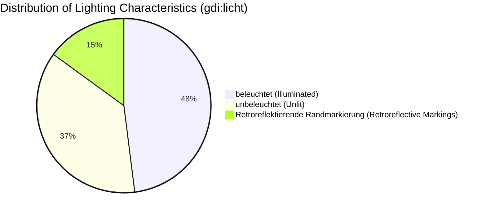
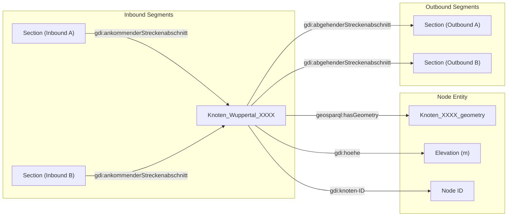

# Data Analysis & Structural Report: Radnetz Wuppertal Linked Open Data (RDF/Turtle)

## 1. Executive Summary

This report provides a comprehensive overview and detailed structural analysis of the cycling network dataset (**Radnetz NRW - Wuppertal Subset**) provided in RDF Turtle (`.ttl`) format. The dataset represents spatial and topological infrastructure data modeled according to the **GDI-DE** (Geodateninfrastruktur Deutschland) ontology and the **OGC GeoSPARQL** standard.

---

## 2. Dataset Overview & Ontology Architecture

The dataset combines domain-specific transport ontology predicates with standard spatial Linked Data standards.

### 2.1 Namespaces & Prefixes
* **`ex-nw:`** `<https://registry.gdi-de.org/de.nw/radnetz/instances/>` — Instance identifiers for network nodes (`Knoten`), geometry objects, and sections (`Section`).
* **`gdi:`** `<https://registry.gdi-de.org/up3/ontology/>` — Domain ontology defining topological relations, network properties, and physical characteristics.
* **`geosparql:`** `<http://www.opengis.net/ont/geosparql#>` — OGC standard vocabulary for spatial features, geometries, and WKT literals.
* **`owl:`** `<http://www.w3.org/2002/07/owl#>` — Web Ontology Language metadata.
* **`xsd:`** `<http://www.w3.org/2001/XMLSchema#>` — XML Schema datatypes.

---

## 3. Schema & Vocabulary Specification

### 3.1 Defined Ontology Properties

| Property Identifier | Property Type | Domain / Context | Description |
| :--- | :--- | :--- | :--- |
| `geosparql:asWKT` | `owl:DatatypeProperty` | `geosparql:Geometry` | Well-Known Text representation of spatial coordinates (3D Point / LineString) |
| `geosparql:hasGeometry` | `owl:ObjectProperty` | `geosparql:Feature` | Links a physical feature to its geometric representation |
| `gdi:abgehenderStreckenabschnitt` | `owl:ObjectProperty` | `gdi:Knoten` | Connects a junction node to outbound cycling network segments |
| `gdi:ankommenderStreckenabschnitt`| `owl:ObjectProperty` | `gdi:Knoten` | Connects an inbound cycling network segment to the junction node |
| `gdi:beginntBeiKnoten` | `owl:ObjectProperty` | `gdi:Strecke` / Section | Denotes start node of a section |
| `gdi:endetBeiKnoten` | `owl:ObjectProperty` | `gdi:Strecke` / Section | Denotes end node of a section |
| `gdi:fuehrung` | `owl:ObjectProperty` | `gdi:Streckenabschnitt` | Routing / guidance classification |
| `gdi:geometrieAbschnitt` | `owl:ObjectProperty` | `gdi:Streckenabschnitt` | Segment-specific geometry link |
| `gdi:geometrieKnoten` | `owl:ObjectProperty` | `gdi:Knoten` | Node-specific geometry link |
| `gdi:hoehe` | `owl:DatatypeProperty` | `gdi:Knoten` | Elevation above sea level in meters (float) |
| `gdi:knoten-ID` | `owl:DatatypeProperty` | `gdi:Knoten` | Unique node identifier code |
| `gdi:licht` | `owl:ObjectProperty` | `gdi:Streckenabschnitt` | Lighting conditions / illumination feature |
| `gdi:quell-ID` | `owl:DatatypeProperty` | All entities | Source data reference identifier |
| `gdi:richtung` | `owl:ObjectProperty` | `gdi:Streckenabschnitt` | Directionality (e.g. bidirectional, unidirectional) |
| `gdi:steigung` | `owl:DatatypeProperty` | `gdi:Streckenabschnitt` | Incline / slope percentage |
| `gdi:strecken-ID` | `owl:DatatypeProperty` | `gdi:Streckenabschnitt` | Segment route identifier |

### 3.1 Wuppertal Property Mapping

| Source Property | Status | Target Radnetz Ontology Property | Property Type | Target Value / Codelist |
| :--- | :---: | :--- | :--- | :--- |
| **`STR_NR`** | 🟢 Mapped | `gdi:quell-ID` & `gdi:strecken-ID` | `owl:DatatypeProperty` (`xsd:string`) | Section sequence identifier string (e.g. `"1225538"`). |
| **`STEIGUNG`** | 🟢 Mapped | `gdi:steigung` | `owl:DatatypeProperty` (`xsd:double`) | Numeric slope percentage floating-point value (e.g. `1.084937`). |
| **`BELEUCHT`** | 🟢 Mapped | `gdi:licht` | `owl:ObjectProperty` | Codelist IRI: `balm-code:Licht/1` (*"beleuchtet"*) or `balm-code:Licht/2` (*"unbeleuchtet"*). |
| **`TYP_LINKS`** | 🟢 Mapped | `gdi:fuehrung` & `gdi:richtung` | `owl:ObjectProperty` | Section split (`_left`). Guidance: `balm-code:Fuehrung/*`, Direction: `balm-code:Richtung/3`. |
| **`TYP_RECHTS`** | 🟢 Mapped | `gdi:fuehrung` & `gdi:richtung` | `owl:ObjectProperty` | Section split (`_right`). Guidance: `balm-code:Fuehrung/*`, Direction: `balm-code:Richtung/2`. |
| **`KNO_VON`** | 🟢 Mapped | `gdi:beginntBeiKnoten` | `owl:ObjectProperty` | Topologic start node URI (`ex-nw:Knoten_Wuppertal_*`). |
| **`KNO_NACH`** | 🟢 Mapped | `gdi:endetBeiKnoten` | `owl:ObjectProperty` | Topologic end node URI (`ex-nw:Knoten_Wuppertal_*`). |
| **`HOEHE_VON`** | 🟢 **Mapped** | `gdi:hoehe` (Start Node) | `owl:DatatypeProperty` (`xsd:double`) | Elevation at start node in meters (e.g. `331.07`). |
| **`HOEHE_NACH`** | 🟢 **Mapped** | `gdi:hoehe` (End Node) | `owl:DatatypeProperty` (`xsd:double`) | Elevation at end node in meters (e.g. `332.53`). |

---

## 4. Instance Analysis & Network Topology

### 4.1 Feature Breakdown
* **Primary Feature Class:** `gdi:Knoten` (Network Nodes / Junctions), co-typed as `geosparql:Feature`.
* **Geometry Class:** `geosparql:Geometry` (3D Point representations with `POINT (Lon Lat Elevation)`).
* **Referenced Edge Entities:** `ex-nw:Section_Wuppertal_*` referenced through incoming (`ankommenderStreckenabschnitt`) and outgoing (`abgehenderStreckenabschnitt`) relations.

### 4.2 Elevation & Coordinate Distribution
* **Geographical Scope:** City of Wuppertal, North Rhine-Westphalia (NRW), Germany.
  * Latitude: ~51.16° N – 51.32° N
  * Longitude: ~7.02° E – 7.32° E
* **Elevation Profile (`gdi:hoehe`):**
  * Minimum elevation: ~115.06 m (Wupper valley bottom / lower terrain)
  * Maximum elevation: ~346.08 m (highland ridges / hills surrounding Wuppertal)
  * Mean elevation: ~210 m

---

## 5. Segment Attributes & Lighting Properties (`gdi:licht`)

In the GDI-DE cycling network model, the property `gdi:licht` categorizes route infrastructure according to visibility and lighting conditions.

### 5.1 Infrastructure Illumination Classification
1. **`beleuchtet` (Illuminated / Street-lit):** Segment equipped with active continuous night-time lighting.
2. **`unbeleuchtet` (Unlit):** Segment without dedicated artificial lighting (predominant in forested / rural sections).
3. **`Retroreflektierende Randmarkierung` (Retroreflective Border Markings):** Passive guidance systems with light-reflecting markings or delineators.

---

## 6. Topological Connectivity & Graph Model

Each junction node models the local network topology explicitly:

---

## 7. Data Quality & Linked Data Best Practices Assessment

1. **Standards Compliance:** Strict adherence to OGC GeoSPARQL WKT standards with 3-dimensional coordinates `POINT (X Y Z)` ensuring spatial interoperability in GIS tools (e.g., QGIS, PostGIS).
2. **Disambiguation:** Explicit separation of Feature (`gdi:Knoten`) and Geometry (`geosparql:Geometry`) instances, following W3C / OGC spatial ontology recommendations.
3. **Topological Completeness:** Bidirectional linking capabilities between nodes and segments enabling routing algorithms and network graph traversals.

---
